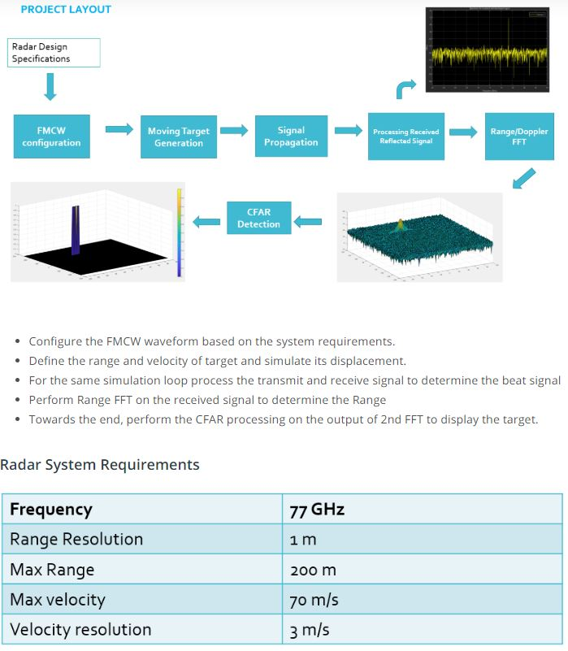
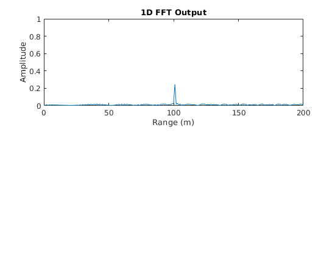
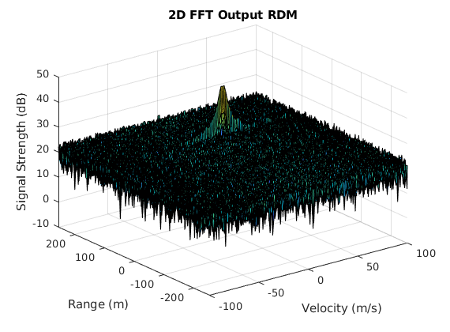
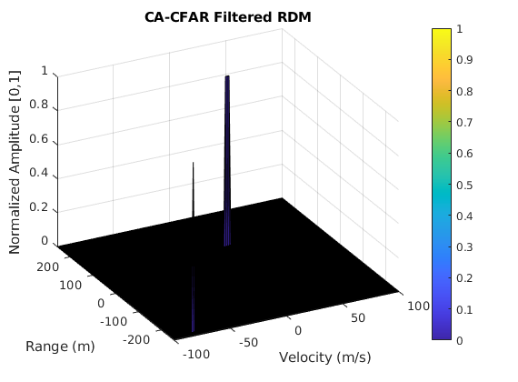

# SFND_Radar_Target_Generation_and_Detection

This repository is for the third project of the Udacity Sensor Fusion Nanodegree



## Prerequisites & Run the code

* MATLAB
* run the `Radar_Target_Generation_and_Detection.m` file in MATLAB


## Code Output

If the code has been run successfully, you should see the following results in the MATLAB Command Window:

```matlab
B =

   150000000


Tchirp =

   7.3333e-06


slope =

   2.0455e+13
```


And three figures will pop-up:

* Figure 1:

  

* Figure 2:

  

* Figure 3:

  


## Implementation of the 2D CFAR

The 2D CFAR uses matrix `RDM`, where all the 2D Fast Fourier Transform results are stored in dB,  from the previous part of the code as the input.

**Step 1: ** Every element in `RDM` will be normalized by minus the maximum element in it. (we use minus instead of dividing because the values are stored in log)

**Step 2: ** Loop through all the valid Cells Under Test (CUT) in the 2D matrix `RDM` , and find the corresponding  training cells for each of the target CUT and calculate the average noise level (converted from dB to pow).

**Step 3: ** The local average noise level will then be converted to dB and added by a Signal to Noise Ratio (`SNR`) value to calculate the noise threshold, `noise_threshold`, in dB.

**Step 4: ** Every element in `RDM` will then be compared to this `noise_threshold`, if the value is below the threshold, a `0` will be assign at its position, else it would be a `1`. 

**Step 5: ** At last, all the boundary cells in `RDM` that do not have enough training cells to preform the CA-CFAR, will be assigned with a `0` at its place as well. 


## Selection of Training, Guard cells and offset

**Number of Training Cells: ** 

```matlab
Tr = 12;
Td = 9;
```

The larger the number of training cells, a wider section of cells in the range or velocity dimension will be included to "average" the local noise level for the specific CUT.

**Number of Guard Cells: ** 

```matlab
Gr = 5;
Gd = 3;
```

The larger the number of guard cells, more neighboring cells will be excluded in the noise level calculation to prevent the effect from the signal that belongs to this CUT.

**SNR (Offset): ** 

```matlab
SNR = pow2db(2.1);
```

The larger the SNR value is, the higher the threshold is, and less targets remains after the filtering


## Steps taken to suppress the non-thresholded cells at the edges

The cells in 2D matrix `RDM` that are `(Tr+Gr)` away from the 4 boundaries are set to `0` :

```matlab
RDM(1:(Tr+Gr), :) = 0;
RDM(end-(Tr+Gr-1):end, :) = 0;
RDM(:, 1:(Td+Gd)) = 0;
RDM(:, end-(Td+Gd-1):end) = 0;
```

